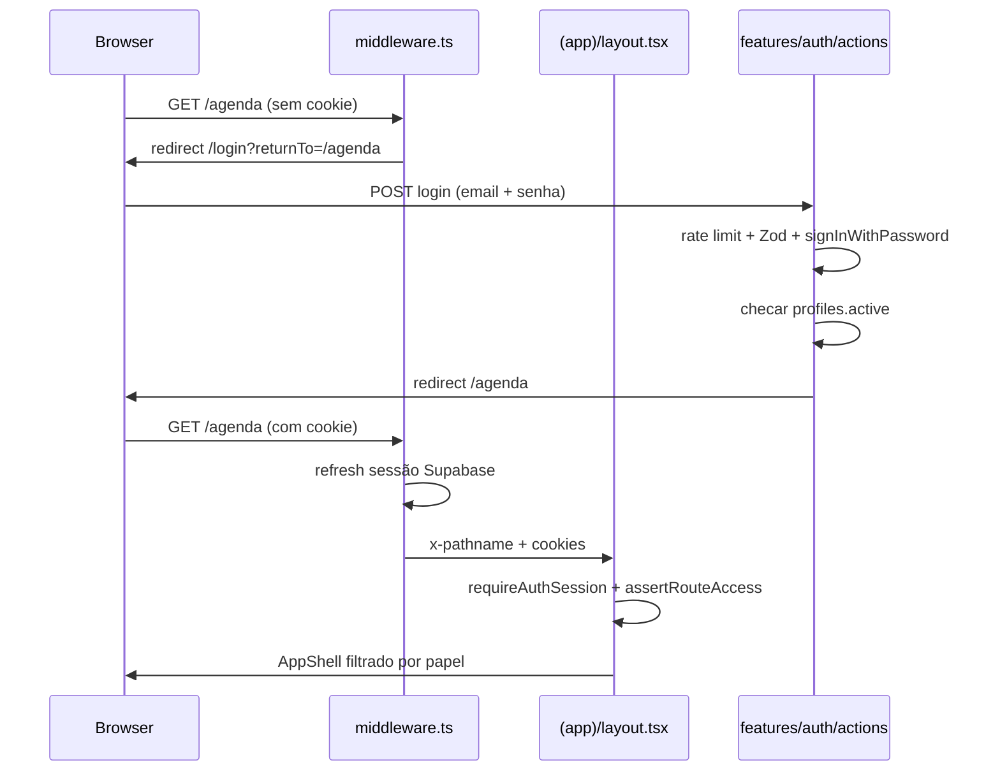

# Arquitetura · ClinRoma

Visão geral para quem vai implementar ou dar manutenção no sistema.

---

## Princípios

1. **Single-tenant** (Clínica Neo Roma): sem `clinic_id`; isolamento por sessão autenticada e **papel**.
2. **Server-first:** React Server Components por padrão; `use client` só para interação de navegador.
3. **Defense in depth:** guarda na aplicação **e** Row Level Security (RLS) no Postgres.
4. **Package by feature:** domínio em `src/features/<nome>/`, não espalhado na raiz.
5. **Mobile-first:** celular é dispositivo primário do dentista (áudio) e da auxiliar (QR).

---

## Mapa de pastas

```text
clinroma/
├── middleware.ts                 # refresh de sessão + redirect auth
├── supabase/migrations/          # SQL por domínio (001, 002, …)
├── docs/
│   ├── manual-dev/               # este manual
│   ├── implementation/           # o que foi entregue por fase
│   └── state/PENDENCIAS.md       # o que falta
└── src/
    ├── app/
    │   ├── (app)/                # rotas autenticadas (shell + guarda)
    │   ├── (auth)/login/         # login (fora do shell)
    │   └── fila/resposta/        # link público do paciente (sem login)
    ├── features/                 # uma pasta por domínio de negócio
    │   └── auth/                 # login, logout, schemas (Fase 1)
    ├── components/
    │   ├── app-shell.tsx         # layout navegação + logout
    │   └── ui/                   # shadcn (Button, Input, …)
    ├── lib/
    │   ├── auth/                 # sessão, papéis, guarda
    │   ├── audit/                # write-audit-log
    │   ├── supabase/             # client, server, admin, types
    │   └── env.ts                # validação de variáveis
    └── types/clinroma.ts         # enums e módulos compartilhados com UI
```

---

## Superfícies da aplicação

| Superfície | Rota | Auth | Shell |
| ---------- | ---- | ---- | ----- |
| Marketing / redirect | `/` | não | não |
| Login | `/login` | não | não |
| Módulos internos | `/hoje`, `/agenda`, … | sim | sim |
| Acesso negado | `/acesso-negado` | sim | sim |
| Fila pública (paciente) | `/fila/resposta/[token]` | não | não |

---

## Fluxo de autenticação (Fase 1)



**Camadas de autorização:**

1. **Middleware:** visitante sem sessão → `/login`; sessão válida em `/login` → destino padrão.
2. **Layout `(app)`:** carrega perfil (`profiles`), bloqueia módulo proibido → `/acesso-negado`.
3. **AppShell:** oculta links de módulos não permitidos ao papel.
4. **RLS (Postgres):** última linha de defesa; token válido fora da política → zero linhas ou erro.

---

## Papéis e módulos

| Papel | Código DB | Módulos |
| ----- | --------- | ------- |
| Administrador | `admin` | todos |
| Dentista | `dentist` | Hoje, Agenda, Pacientes, Fila, Estoque (leitura/escrita conforme matriz) |
| Recepção | `reception` | Hoje, Agenda, Pacientes, Fila, Estoque (sem Scan QR) |
| Auxiliar de sala | `room_assistant` | Estoque, Scan QR |
| Visualizador | `viewer` | Hoje, Agenda, Pacientes (sem conteúdo clínico sensível na RLS) |

Mapa TypeScript: `src/lib/auth/roles.ts` · enums UI: `src/types/clinroma.ts`.

---

## Padrão por feature (Fases 2+)

Cada domínio novo segue:

```text
src/features/<dominio>/
  components/     # UI (client mínimo)
  actions.ts      # Server Actions (escrita) + Zod
  queries.ts      # leitura para RSC
  schemas.ts      # Zod compartilhado
```

Regras:

- Validar entrada com **Zod** na borda de toda action.
- Revalidar **papel** server-side antes de escrever.
- Confiar na **RLS** mesmo com checagem na action.
- Arquivos com **~300 linhas** no máximo; dividir por subdomínio se passar.

---

## Modelo de dados (visão por domínio)

| Domínio | Tabelas principais | Migration |
| ------- | ------------------ | --------- |
| Identidade | `profiles`, `dentists` | `001` |
| Pacientes / prontuário | `patients`, `medical_records`, `tooth_findings`, `record_attachments` | `002` |
| Agenda | `appointments` | `003` |
| Estoque | `supplies`, `supply_packages`, `supply_movements`, `supply_sheets` | `004` |
| Fila | `waitlist_entries`, `slot_offers`, `patient_slot_responses` | `005` |
| Transversal | `reminders`, `audit_log` | `006` |
| Storage | buckets `record-photos`, `record-audio`, `supply-sheets`, `supply-labels` | `007` |

Detalhe das colunas: migrations em `supabase/migrations/` e tipos em `src/lib/supabase/database.types.ts`.

---

## Supabase: três clients

| Client | Arquivo | Uso |
| ------ | ------- | --- |
| Browser | `src/lib/supabase/client.ts` | componentes client (raro) |
| Server | `src/lib/supabase/server.ts` | RSC, Server Actions, middleware |
| Admin | `src/lib/supabase/admin.ts` | **server-only** · service role · seed/jobs |

**Nunca** expor `SUPABASE_SERVICE_ROLE_KEY` no client ou em variáveis `NEXT_PUBLIC_*`.

---

## Variáveis de ambiente

| Variável | Onde | Obrigatória |
| -------- | ---- | ----------- |
| `NEXT_PUBLIC_SUPABASE_URL` | client + server | sim (F1+) |
| `NEXT_PUBLIC_SUPABASE_ANON_KEY` | client + server | sim (F1+) |
| `NEXT_PUBLIC_APP_URL` | redirects | não (default localhost HTTPS) |
| `SUPABASE_DB_PASSWORD` | `npm run db:push` | só para migrations |
| `SUPABASE_SERVICE_ROLE_KEY` | admin client | opcional (seed/jobs) |

Copiar de `.env.example` → `.env.local`. **Nunca commitar** `.env.local`.

---

## Testes

| Tipo | Onde | Quando |
| ---- | ---- | ------ |
| Unitário (domínio, papéis, audit) | `src/**/*.test.ts` | `npm run test` |
| RLS integração | `src/lib/auth/rls-policy.test.ts` | `RUN_RLS_TESTS=true npm run test` |
| Manual UI | Fase 6 | skill `manual-report` |

Meta de cobertura ~80% em domínio e actions a partir das features F2+.
