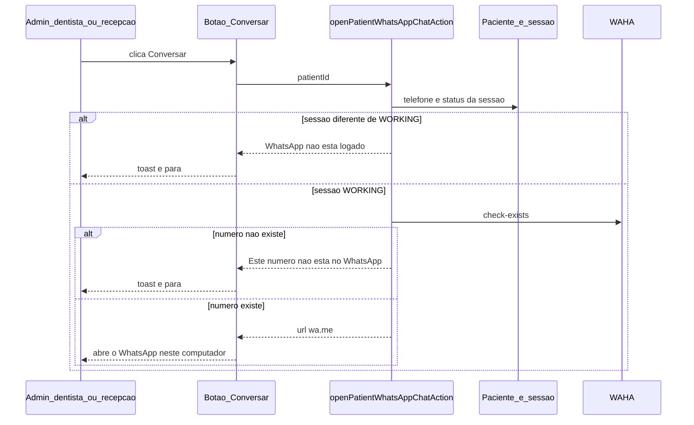

# Plano · Conversar com o paciente no WhatsApp

> Fatia operacional (agenda, ficha, fila + canal F7) · Autonomia: **medium**
> Status: **rascunho · aguardando aprovação**
> Data: **2026-10-06**
> Origem: reunião com o cliente. No modal da consulta (e nas mesmas pessoas na ficha, na lista do dia e na fila), um botão abre o WhatsApp daquele número.

**Pronto quando:** admin, dentista ou recepção clica em "Conversar" no modal da consulta, na ficha do paciente, na lista do dia e no card da fila; o servidor confere a sessão da clínica e se o número existe no WhatsApp; sessão fora de `WORKING` mostra "WhatsApp não está logado."; número ausente no WhatsApp mostra "Este número não está no WhatsApp."; os dois ok abrem `https://wa.me/{número}` neste computador, sem texto clínico. Visualizador e auxiliar não veem o botão. Nenhum disparo pelo gateway.

Nenhum código até este plano ser aprovado.

---

## Como usar no workflow

1. Aprovar este plano (e as premissas da última seção, se discordar).
2. Branch + código. Sem spec nova no vault.
3. Homologar com a sessão `default` logada e com um número que existe no WhatsApp e outro que não existe.

---

## Objetivo

A recepção (e quem já lê o status da sessão) abre uma conversa no WhatsApp do aparelho em que está, a partir do paciente que está na tela. O ClinRoma não vira inbox e não manda a mensagem pelo número pareado.

O clique só abre o chat depois de duas conferências no servidor:

1. A sessão da clínica está `WORKING` (a mesma linha que o chip do menu já lê).
2. O gateway responde que aquele número existe no WhatsApp.

Telefone usado: o do cadastro, se for válido; senão o segundo contato. A regra já está em [`resolveWhatsAppDestination`](../../src/features/records/domain/whatsapp-destination.ts). O número não entra no payload da agenda nem da fila: o botão leva só `patientId`.

Quem vê o botão: **admin**, **dentist** e **reception** (`canReadWhatsAppSessionStatus`). Na fila o dentista só lê o quadro, então o botão não depende de `canWrite`. Visualizador vê agenda e ficha, mas não lê o status da sessão: fica sem o botão. Auxiliar não entra nessas telas.

---

## 1. Abordagem (6 passos)

**Passo 1. Domínio do link e dos textos.** Função pura que monta `https://wa.me/{dígitos}` a partir do destino já normalizado (DDI 55). Sem `text` na URL: procedimento, observação e nome não saem do ClinRoma. Textos fixos: "Conversar", "WhatsApp não está logado.", "Este número não está no WhatsApp.". Sem telefone aproveitável, reutilizar o sentido de "Cadastre o telefone do paciente ou um segundo contato". Se o destino for o segundo contato, o toast de sucesso diz "Abrindo conversa com o segundo contato.". Parser da resposta do gateway: só `numberExists === true` libera o link.

**Passo 2. Consulta ao gateway (server-only).** Nova função ao lado de [`waha-session.ts`](../../src/features/whatsapp/lib/waha-session.ts), reusando `readWhatsAppChannelConfig` e o header `X-Api-Key`. Endpoint: `GET /api/contacts/check-exists?phone={digitos}&session={sessao}`, no mesmo base URL de [`sendWhatsApp`](../../src/lib/whatsapp/send-whatsapp.ts). Timeout de 15 s. Log só com destino mascarado (`maskWhatsAppDestination`). **Não mudar** o contrato de `sendWhatsApp`. Três resultados: número existe, número não existe, consulta falhou. Falha de rede ou HTTP usa o texto que já existe: "Não foi possível falar com o WhatsApp da clínica. Tente de novo em instantes." Erro que indique sessão parada cai no texto "WhatsApp não está logado.", para o status velho no banco não acusar o número.

**Passo 3. Action autenticada, arquivo próprio.** Não misturar com start, QR e logout de [`actions.ts`](../../src/features/whatsapp/actions.ts). `requireAuthSession`. Recusa visualizador e auxiliar no servidor. Lê telefones do paciente com a sessão (RLS). Resolve o destino. Lê [`getClinicWhatsAppSessionStatus`](../../src/features/whatsapp/queries.ts). Fora de `WORKING`: devolve o aviso e não chama o gateway. Em `WORKING`: chama o check-exists. Sucesso devolve só a URL. Sem `service_role`. Sem gravar auditoria neste corte.

**Passo 4. Botão único.** Client pequeno: clique, estado de espera, um toast, `window.open` da URL devolvida. Alvo de toque de 44 px. Enquanto a action não volta, o botão não dispara outra consulta. O componente recebe `patientId` e `canOpen`.

**Passo 5. Quatro superfícies.** O mesmo botão entra em:

- Modal da consulta: [`appointment-detail.tsx`](../../src/features/agenda/components/appointment-detail.tsx), visível também para quem só lê a agenda (dentista).
- Ficha: [`patient-summary.tsx`](../../src/features/patients/components/patient-summary.tsx), montada por [`patient-chart.tsx`](../../src/features/records/components/patient-chart.tsx).
- Lista do dia: [`agenda-day-list.tsx`](../../src/features/agenda/components/agenda-day-list.tsx). O clique no botão não abre o modal da consulta. A lista também aparece no intervalo em [`agenda-range-list.tsx`](../../src/features/agenda/components/agenda-range-list.tsx); o prop desce por ali.
- Card da fila: [`waitlist-card.tsx`](../../src/features/waitlist/components/waitlist-card.tsx), para quem lê o quadro (dentista inclusive), sem exigir `canWrite`.

As páginas [`agenda/page.tsx`](../../src/app/(app)/agenda/page.tsx) e [`fila/page.tsx`](../../src/app/(app)/fila/page.tsx) só repassam se o papel pode abrir o chat. A ficha decide isso em `patient-chart.tsx` com `canReadWhatsAppSessionStatus`.

**Passo 6. Testes e nota de segurança.** Vitest do domínio (URL sem query clínica, parser do `numberExists`, textos) e da consulta ao gateway com `fetch` injetável (existe, não existe, HTTP ruim, timeout). Action: papel recusado não chama o gateway. Uma linha em [`docs/SECURITY.md`](../SECURITY.md): o clique não dispara mensagem; a chave continua no servidor; o log mascara o destino. Trio vivo (implementation, manual-dev, PENDENCIAS) na hora de fechar a fatia, não neste rascunho.

---

## 2. Arquivos a criar / alterar

**Criar**

- `src/features/whatsapp/domain/chat-link.ts` + `chat-link.test.ts`
- `src/features/whatsapp/lib/check-whatsapp-number.ts` + teste (`fetch` injetável)
- `src/features/whatsapp/open-patient-chat-action.ts`
- `src/features/whatsapp/components/patient-whatsapp-chat-button.tsx`

**Alterar**

- [`src/features/agenda/components/appointment-detail.tsx`](../../src/features/agenda/components/appointment-detail.tsx)
- [`src/features/agenda/components/agenda-day-list.tsx`](../../src/features/agenda/components/agenda-day-list.tsx)
- [`src/features/agenda/components/agenda-range-list.tsx`](../../src/features/agenda/components/agenda-range-list.tsx)
- [`src/features/agenda/components/agenda-view.tsx`](../../src/features/agenda/components/agenda-view.tsx)
- [`src/features/patients/components/patient-summary.tsx`](../../src/features/patients/components/patient-summary.tsx)
- [`src/features/records/components/patient-chart.tsx`](../../src/features/records/components/patient-chart.tsx)
- [`src/features/waitlist/components/waitlist-card.tsx`](../../src/features/waitlist/components/waitlist-card.tsx)
- [`src/app/(app)/agenda/page.tsx`](../../src/app/(app)/agenda/page.tsx)
- [`src/app/(app)/fila/page.tsx`](../../src/app/(app)/fila/page.tsx)
- [`docs/SECURITY.md`](../SECURITY.md) (uma nota na seção de disparo)

**Não alterar o contrato:** [`src/lib/whatsapp/send-whatsapp.ts`](../../src/lib/whatsapp/send-whatsapp.ts). A query da agenda e a query da fila continuam sem colunas de telefone.

---

## 3. Fora de escopo

- Card "Consultas de hoje" na Hoje e a lista geral de pacientes
- Mensagem pré-preenchida, histórico, inbox, DeskcommCRM
- Disparo pelo número da clínica (`sendText`, oferta da fila, pós-cirurgia, questionário)
- Auditoria do clique
- Migration, RLS nova, `service_role`
- Visualizador e auxiliar
- Fechar a Fase 7

---

## 4. Riscos técnicos

- **Contrato do check-exists.** O gateway deste repo fala WAHA (`/api/sendText`, `chatId` com `@c.us`). A consulta prevista é `GET /api/contacts/check-exists`. Resposta sem `numberExists: true` não libera o link. HTTP ruim ou corpo inesperado vira falha de canal, não "número não está no WhatsApp".
- **Status no banco atrasado.** O chip não consulta a WAHA ao vivo. Se a linha diz `WORKING` e a sessão caiu, a consulta ao gateway devolve erro de sessão e a tela mostra "WhatsApp não está logado.".
- **Latência.** Cada clique espera o gateway, com teto de 15 s. O botão fica em espera e ignora um segundo clique.
- **Dois WhatsApps.** A conferência de "logado" e de "número existe" usa a sessão da clínica. O `wa.me` abre o WhatsApp deste computador. Se esse aparelho não estiver no número da clínica, a conversa sai da conta logada ali.
- **Segundo contato.** Sem flag "tem WhatsApp". Mãe ou responsável pode ser o destino. O toast de sucesso avisa quando a origem é o segundo telefone.
- **Clique na lista do dia.** O item inteiro abre o modal. O botão precisa impedir esse clique de subir, senão a recepção abre o detalhe junto com o WhatsApp.
- **Telefone fixo.** Dez dígitos passam na regra atual de destino e o WhatsApp pode responder que o número não existe. Aí o aviso da tela está certo.

---

## 5. Path crítico

**Sim, só no clique.**

Toca:

- Leitura do paciente (telefone) com a sessão já autenticada
- Leitura de `whatsapp_session_status` (a mesma de [`getClinicWhatsAppSessionStatus`](../../src/features/whatsapp/queries.ts))
- Uma consulta nova no gateway, no momento do clique
- Quatro telas de uso diário: modal da consulta, ficha, lista do dia, card da fila

Não toca: cancelar consulta, conflito de horário, `sendWhatsApp`, oferta da fila, pós-cirurgia, questionário, pareamento, QR, jobs `/api/cron/*`, políticas de escrita.

---

## Premissas (apontar se discordar)

1. O chat abre neste computador (`wa.me`). A sessão da clínica só serve para saber se está logada e se o número existe.
2. URL sem texto. Procedimento e observação ficam no ClinRoma.
3. Botão para admin, dentista e recepção. Na fila, dentista com leitura também vê o botão.
4. Sem telefone aproveitável, toast pedindo cadastro. O botão continua visível: a action decide.
5. Check-exists é leitura. Não grava `patient_messages` e não entra no cron.
