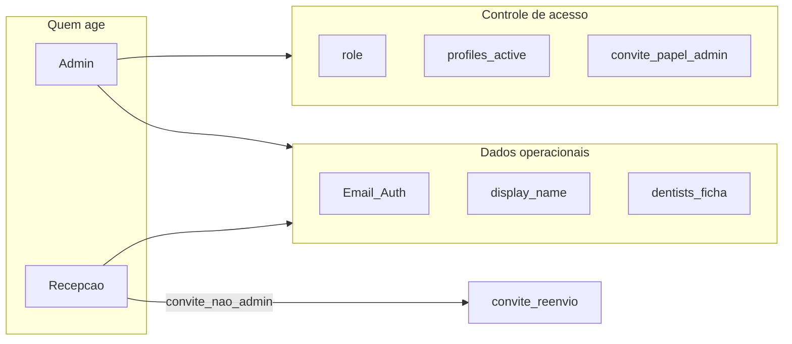

# Plano · Edição da Equipe (dados + RBAC recepção)

> Fatia F7-11b (extensão da gestão de acessos) · Autonomia: **medium**
> Status: **rascunho · aguardando aprovação**
> Data: **2026-09-09**
> Origem: homologação manual (admin sem UI para trocar e-mail do dentista) · decisão de escopo **item 3** + modelo **B** (recepção operacional)

**Pronto quando:** admin e recepção abrem `/equipe`, editam e-mail, nome de exibição e (quando aplicável) dados do dentista (nome clínico, CRO, cor da agenda, ativo na agenda); recepção convida e reenvia convite só para papéis não-admin; só o admin troca papel e ativa/desativa acesso; ninguém altera a si mesmo nem promove/desativa admin pela recepção; testes de domínio e docs vivos atualizados.

Nenhum código até este plano ser aprovado.

---

## Como usar no workflow

1. Aprovar este plano (e as premissas da última seção, se discordar).
2. Spec curta no repo + branch `feature/equipe-edicao` + código.
3. Homologação: TC novos (ou extensão FL-11) no relatório manual; não fecha a Fase 7 sozinha.

---

## Objetivo

Hoje `/equipe` (F7-11) só **cria** colaborador, troca papel, ativa/desativa e reenvia convite. O e-mail fica só leitura depois da criação; não há edição de nome nem de `dentists` (CRO, cor). O admin precisava ir ao Supabase Auth para corrigir e-mail.

Esta fatia entrega **edição completa dos dados** e libera a **recepção** no dia a dia sem entregar o poder de controle de acesso.

### Matriz RBAC (modelo B — fechado)

| Ação | Admin | Recepção |
| ---- | ----- | -------- |
| Ver `/equipe` e listar colaboradores | sim | sim |
| Editar e-mail (Auth) | sim | sim (alvo não-admin) |
| Editar nome de exibição (`profiles.display_name`) | sim | sim (alvo não-admin) |
| Editar ficha do dentista (`dentists`: `full_name`, `cro`, `calendar_color`, `active`) | sim | sim |
| Criar colaborador / reenviar convite | sim (qualquer papel) | sim (**só** papéis não-admin) |
| Trocar papel (`role`) | sim | **não** |
| Ativar / desativar acesso (`profiles.active`) | sim | **não** |
| Alterar a si mesmo (papel/acesso) | não | não |
| Alvo com papel `admin` (e-mail, nome, convite, etc.) | sim | **não** |

Papéis convidáveis pela recepção: `dentist`, `reception`, `room_assistant`, `viewer`.

---

## Premissas (fechar com a aprovação)

1. **E-mail mora em `auth.users`**, não em `profiles`. Atualização via `service_role` (`auth.admin.updateUserById`). Confirmar e-mail no Auth conforme política do projeto (evitar login fantasma).
2. **Não criar dentista automaticamente** ao promover alguém a `dentist` (já é assim hoje). A ficha `dentists` só aparece na UI de edição se existir vínculo `profile_id` (ou botão "Vincular ficha de agenda" só para admin, fora deste corte se não houver linha).
3. **Cor da agenda:** validar hex (`#RRGGBB`) no Zod; sem seletor fancy no MVP (input cor nativo + texto).
4. **Exclusão definitiva** continua fora de escopo (desativar preserva FKs).
5. **RLS `dentists_write`** já inclui `admin` e `reception` ([`001_profiles_dentists.sql`](../../supabase/migrations/001_profiles_dentists.sql)). `profiles` UPDATE continua restrito; recepção **não** ganha `UPDATE` em `role`/`active`. Para `display_name`, preferir action com cliente autenticado + policy nova **ou** `service_role` só no campo nome, com guarda de domínio espelhando a matriz B.
6. Dock mobile **não** ganha 6º ícone; Equipe segue pelo menu de conta (como hoje para admin).

---

## 1. Abordagem (6 passos)

**Passo 1. Domínio e RBAC.** Estender [`src/features/team/domain/team-guards.ts`](../../src/features/team/domain/team-guards.ts):

- `canAccessTeam(role)` → admin e reception (módulo `team` com pelo menos leitura/escrita operacional).
- `canManageAccess(role)` → só admin (papel + ativo).
- `canInviteRole(actor, targetRole)` → admin: qualquer; reception: só não-admin.
- `canEditCollaboratorData(actor, target)` → admin: qualquer; reception: alvo com `role !== 'admin'`; nunca se `actorId === targetId` para e-mail se quisermos forçar autoatendimento via Auth (decisão: **permitir editar o próprio e-mail/nome**; **bloquear** auto-troca de papel/ativo como já existe).
- `RECEPTION_INVITABLE_ROLES` constante.
- Copy pt-BR para e-mail em uso, e-mail atualizado, ficha salva, sem permissão.

Ajustar [`src/lib/auth/roles.ts`](../../src/lib/auth/roles.ts): `reception.team = "write"` (ou `"read"` + writes granulares nas actions — preferir `"write"` com actions que recusam o que a matriz B proíbe). Atualizar testes em `roles.test.ts` e pendência F7-11 que hoje exige recepção **sem** Equipe.

**Passo 2. Schemas + actions.** Em [`schemas.ts`](../../src/features/team/schemas.ts) e [`actions.ts`](../../src/features/team/actions.ts):

- `updateCollaboratorProfileSchema` → `collaboratorId`, `displayName`, `email`.
- `updateDentistCardSchema` → `dentistId` (ou `collaboratorId` + lookup), `fullName`, `cro` opcional, `calendarColor`, `active`.
- Actions: `updateCollaboratorProfileAction`, `updateDentistCardAction`.
- Restringir `inviteCollaboratorAction` / `resendInviteAction`: se ator é reception, `role` ∈ `RECEPTION_INVITABLE_ROLES` e alvo do reenvio não é admin.
- `changeRoleAction` / `setActiveAction`: manter `requireTeamManager` estrito a **admin** (`canManageAccess`), não só `canAccessTeam`.
- E-mail: `createAdminClient().auth.admin.updateUserById(id, { email })`; tratar conflito; `logTeamAudit("collaborator_email_updated" | "collaborator_profile_updated" | "dentist_card_updated", ...)`.
- `revalidatePath("/equipe")` e, se cor/nome clínico mudarem, paths de agenda/`/hoje` que leem `dentists`.

**Passo 3. Banco (se necessário).** Migration nova (ex. `029_team_edit_f7.sql`) **somente se** a abordagem de `display_name` for via sessão autenticada:

- Policy `profiles_update_display_name` para admin + reception, `WITH CHECK` limitando colunas efetivas (trigger já protege `role`/`active` do próprio usuário; estender trigger para **recusar** `role`/`active` alterados por quem não é admin — defesa em profundidade).
- Se tudo de perfil/e-mail for `service_role` nas actions, a migration pode ser só o reforço do trigger (`actor must be admin to change role/active`) e documentação; grant por coluna permanece como em `028`.

Decisão de implementação preferida: **e-mail e display_name via service_role nas actions** (já padrão de provisionamento) + **dentists via cliente autenticado** (RLS já ok) + trigger: só admin pode mudar `role`/`active`.

**Passo 4. UI.** Estender [`collaborator-row.tsx`](../../src/features/team/components/collaborator-row.tsx) / novo `edit-collaborator-dialog.tsx`:

- Botão **Editar** por linha (visível conforme `canEditCollaboratorData`).
- Dialog: nome, e-mail; se existir `dentist` ligado ao profile, seção Agenda (nome clínico, CRO, cor, ativo na agenda).
- Na lista: recepção **não** vê select de papel nem botão desativar/reativar; admin mantém controles atuais.
- [`collaborator-dialog.tsx`](../../src/features/team/components/collaborator-dialog.tsx): se ator é reception, select de papel sem opção `admin`.
- [`page.tsx`](../../src/app/(app)/equipe/page.tsx): guarda passa a aceitar reception; shell/menu de conta já usa `canAccessModule` — recepção ganha item Equipe.

**Passo 5. Queries.** Em [`queries.ts`](../../src/features/team/queries.ts): incluir na listagem o vínculo opcional com `dentists` (`id`, `full_name`, `cro`, `calendar_color`, `active`) para montar o dialog sem round-trip extra.

**Passo 6. Testes e docs.** Vitest: guards da matriz B; schema de cor/e-mail; invite reception recusa `admin`. Atualizar trio vivo + manual-dev F7-11 (ou capítulo `21-fase-7-11b-edicao-equipe.md`). Atualizar [`PENDENCIAS.md`](../state/PENDENCIAS.md) (item “recepção não vê Equipe” vira “recepção vê Equipe com poderes B”). Casos manuais sugeridos: TC-Equipe-edit e-mail dentista (reception); TC convite admin pela reception → negado; TC admin desativa; TC cor da agenda reflete no calendário.

---

## 2. Arquivos a criar / alterar

**Criar**

- `src/features/team/components/edit-collaborator-dialog.tsx`
- `supabase/migrations/029_team_edit_f7.sql` (se trigger/policy forem necessários)
- `docs/implementation/F7-11b-edicao-equipe.md` (no fechamento)
- `docs/manual-dev/21-fase-7-11b-edicao-equipe.md` (no fechamento)
- Spec curta: `specs/2026-09-09-equipe-edicao.md` (após aprovação)

**Alterar**

- [`src/lib/auth/roles.ts`](../../src/lib/auth/roles.ts) — `reception.team = "write"`
- [`src/features/team/domain/team-guards.ts`](../../src/features/team/domain/team-guards.ts)
- [`src/features/team/schemas.ts`](../../src/features/team/schemas.ts)
- [`src/features/team/actions.ts`](../../src/features/team/actions.ts)
- [`src/features/team/queries.ts`](../../src/features/team/queries.ts)
- [`src/features/team/lib/team-action-context.ts`](../../src/features/team/lib/team-action-context.ts) — `requireTeamAccess` vs `requireTeamAccessManager`
- [`src/features/team/components/collaborator-row.tsx`](../../src/features/team/components/collaborator-row.tsx)
- [`src/features/team/components/collaborator-dialog.tsx`](../../src/features/team/components/collaborator-dialog.tsx)
- [`src/features/team/components/collaborator-list.tsx`](../../src/features/team/components/collaborator-list.tsx)
- [`src/app/(app)/equipe/page.tsx`](../../src/app/(app)/equipe/page.tsx)
- Testes: `roles.test.ts`, guards, schemas; app-shell se listar módulos da reception
- [`docs/state/PENDENCIAS.md`](../state/PENDENCIAS.md), índices implementation/manual-dev no fechamento
- Opcional: menção em [`docs/SECURITY.md`](../SECURITY.md) (quem altera e-mail via service_role)

**Não alterar**

- Fluxo de exclusão hard de usuário Auth
- Deskcomm / WhatsApp inbox
- Seed de dentistas além do necessário para homologação

---

## 3. Ordem de implementação

1. Domínio + `roles.ts` + testes de matriz B (vermelho primeiro).
2. Schemas + actions (profile/email, dentist card) + auditoria.
3. Migration/trigger se a revisão de segurança pedir.
4. Queries com join dentista + UI dialog + ocultar controles de acesso na reception.
5. Lint, test, build; docs de fechamento da fatia.

---

## 4. Riscos e mitigação

| Risco | Mitigação |
| ----- | --------- |
| Recepção promove a admin | Select e Zod sem `admin`; action recusa; teste unitário |
| Recepção desativa admin | UI sem toggle; `setActiveAction` só `canManageAccess` |
| E-mail duplicado no Auth | Tratar erro da Admin API → `TEAM_COPY.emailInUse` |
| Cor inválida quebra CSS da agenda | Zod hex estrito |
| Drift RLS: reception altera `role` no PostgREST | Trigger: não-admin não altera `role`/`active` |
| Confirmar e-mail trava login | Usar `email_confirm: true` no update Admin API (alinhar ao padrão do provisionamento) |

---

## 5. Fora de escopo

- Excluir colaborador do Auth
- Editar senha pelo admin (reset continua via reenvio / recovery)
- Auto-criar linha em `dentists` ao mudar papel para dentista
- OCR / Vision / estoque
- Fechar Fase 7 completa

---

## 6. Critérios de aceite

- [ ] Admin edita e-mail e nome de um dentista sem sair do ClinRoma; login passa a usar o novo e-mail
- [ ] Recepção edita e-mail/nome/CRO/cor de dentista não-admin; agenda reflete cor/nome clínico
- [ ] Recepção convida `dentist`/`reception`/`room_assistant`/`viewer` e reenvia convite
- [ ] Recepção **não** convida `admin`, **não** troca papel, **não** desativa acesso
- [ ] Recepção **não** edita conta com papel `admin`
- [ ] Admin mantém papel + ativo + convite admin
- [ ] Vitest cobre guards da matriz B
- [ ] Docs: implementation + manual-dev + PENDENCIAS atualizados

---

## 7. Decisão registrada

- Escopo de dados: **item 3** (e-mail + nome + ficha do dentista).
- Papel da recepção: **modelo B** (dados + convite/reenvio não-admin; controle de acesso só admin).
