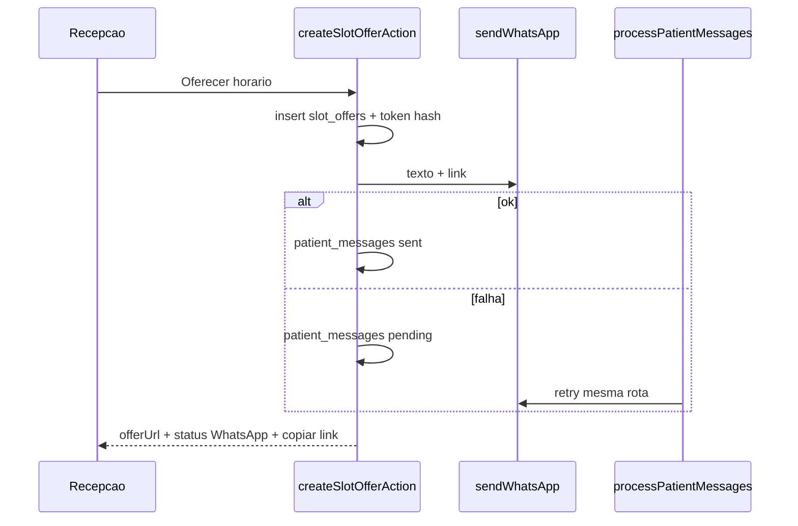

# Plano · Oferta da fila por WhatsApp

> Fatia operacional (F4 + canal F7) · Autonomia: **medium**
> Status: **implementado**
> Data: **2026-08-28**
> Origem: oferta hoje só gera `/fila/resposta/{token}` e a UI copia o link

**Pronto quando:** ofertar horário dispara WhatsApp com texto + link; copiar link permanece; falha de envio vira `patient_messages` pendente no cron já existente; página pública e token de 40 min intactos; sem rota `/api/cron` nova e sem mexer no crontab da VPS.

---

## Como usar no workflow

1. Plano aprovado.
2. Branch + código. Spec histórica F4 **não** editar.

---

## Objetivo

No mesmo instante em que a recepção oferta um horário, o paciente recebe WhatsApp com o texto e o link opaco. Copiar o link vira fallback (canal fora do ar, sem telefone, ou reenvio manual). Se o disparo imediato falhar, a mensagem entra como **pendente** e o cron [`/api/cron/process-patient-messages`](../../src/app/api/cron/process-patient-messages/route.ts) (já no crontab, 4ª rota) tenta de novo. Não criar a 5ª rota.

Contrato de relógio (inalterado): VPS a cada 5 min chama as 4 rotas; jobs são as rotas Next.

---

## Estado atual

- [`createSlotOfferAction`](../../src/features/waitlist/actions.ts) gera token, grava hash em `slot_offers`, monta `{APP_URL}/fila/resposta/{token}` e devolve `offerUrl`. Não chama WhatsApp.
- [`SlotOfferLink`](../../src/features/waitlist/components/slot-offer-link.tsx) só copia. Copy: "Envie este link ao paciente por SMS ou WhatsApp."
- Expire: [`/api/cron/expire-slot-offers`](../../src/app/api/cron/expire-slot-offers/route.ts) (crontab, 200). **Não alterar rota nem crontab.**
- Canal: [`sendWhatsApp`](../../src/lib/whatsapp/send-whatsapp.ts) (`destino` + `texto`). Destino: [`resolveWhatsAppDestination`](../../src/features/records/domain/whatsapp-destination.ts) (telefone do cadastro, senão o 2º).
- Cron de mensagens: [`processPendingPatientMessages`](../../src/features/records/lib/process-pending-patient-messages.ts) busca **somente** `purpose = post_surgery`, `status = pending`, `scheduled_at <= now`, `attempt_count < 3`. `anamnesis_invite` não passa por esse cron (envio imediato; falha grava `failed`, não `pending`).
- Enum `patient_message_purpose`: `post_surgery` | `anamnesis_invite`. Sem valor de fila.
- LGPD pública: [`/fila/resposta/[token]`](../../src/app/fila/resposta/[token]/page.tsx) não muda.



---

## Decisões

- **Purpose novo `slot_offer`.** Não reutilizar `post_surgery` (poluiria a aba pós-cirurgia). Migration incremental `026`. Não editar `001`–`025`.
- **Mesma rota de cron.** Alargar o processador existente: `post_surgery` **ou** `slot_offer`. Sem `/api/cron` novo. Sem crontab.
- **Texto fixo** (sem compositor, igual ao convite de anamnese). Sem nome do paciente, sem CPF, sem motivo clínico:

```
Olá. A Clínica Neo Roma tem um horário disponível para você.

{dd/MM/yyyy} às {HH:mm}, com {nome do dentista}.

Responda pelo link em até 40 minutos:
{url}
```

- **Oferta não desfaz se o WhatsApp falhar.** Link e status `offered` já existem; WhatsApp é pós-commit.
- **Sucesso também grava `patient_messages` `sent`** (auditoria, destino mascarado, padrão F7).
- **Sem telefone:** oferta segue; não insere pendente (cron não tem dígitos); UI pede cadastro + copiar link.
- **Canal ausente ou `send_failed`:** insere `pending` com `scheduled_at = now`, `attempt_count = 0`. Próximo tick (até 5 min) reprocessa. Até 3 tentativas (`POST_SURGERY_MAX_ATTEMPTS`).
- **Não enviar link morto:** no processador, `slot_offer` com `created_at` há mais de 40 min vira `cancelled`, sem disparar. [`expire-slot-offers`](../../src/features/waitlist/lib/expire-slot-offers.ts) **não muda**.
- **Cancelar oferta na recepção:** [`cancelSlotOfferAction`](../../src/features/waitlist/actions.ts) marca `patient_messages` pendentes daquele paciente com `purpose = slot_offer` como `cancelled` (evita WhatsApp depois do cancelamento). Sem FK nova.
- **Papéis:** quem já oferta (admin, recepção). Dentista continua só leitura na fila. Auxiliar/visualizador fora.
- **`expiresAt` no retorno da action** (já calculado no servidor) para a UI não usar `Date.now() + 40 min`.

---

## 1. Abordagem

### Passo 1 · Schema

[`supabase/migrations/026_patient_messages_slot_offer.sql`](../../supabase/migrations/026_patient_messages_slot_offer.sql): `ALTER TYPE patient_message_purpose ADD VALUE IF NOT EXISTS 'slot_offer';`

Atualizar [`src/lib/supabase/database.types.ts`](../../src/lib/supabase/database.types.ts) e [`PATIENT_MESSAGE_PURPOSE`](../../src/features/records/domain/patient-message.ts).

### Passo 2 · Domínio e disparo imediato

Novo módulo em waitlist (não inflar [`actions.ts`](../../src/features/waitlist/actions.ts), já > 300 linhas):

- [`src/features/waitlist/domain/slot-offer-whatsapp.ts`](../../src/features/waitlist/domain/slot-offer-whatsapp.ts): copy, `buildSlotOfferWhatsAppBody({ offerUrl, startsAt, dentistName })`, guarda "sem CPF / sem travessão".
- [`src/features/waitlist/lib/send-slot-offer-whatsapp.ts`](../../src/features/waitlist/lib/send-slot-offer-whatsapp.ts): carrega destinos (reusa `resolveWhatsAppDestination`), chama `sendWhatsApp`, persiste `sent` ou `pending`, audit com destino mascarado.

`createSlotOfferAction` depois do insert da oferta: busca `patient_id` da entrada, dentista, monta URL (igual hoje), chama o lib. Falha de WhatsApp **não** vira `error` da action (a oferta já existe). Retorno extra: `whatsappStatus: "sent" | "queued" | "skipped"`, `expiresAt`.

### Passo 3 · Cron existente

Em [`process-pending-patient-messages.ts`](../../src/features/records/lib/process-pending-patient-messages.ts): query `.in("purpose", [post_surgery, slot_offer])`.

Generalizar [`isDueScheduledMessage`](../../src/features/records/domain/post-surgery-schedule.ts): hoje recusa qualquer purpose ≠ `post_surgery`. Passar a aceitar os dois purposes retryáveis. `anamnesis_invite` continua fora.

Rota [`process-patient-messages/route.ts`](../../src/app/api/cron/process-patient-messages/route.ts): o path não muda; só o JSON interno. Mensagem HTTP pode deixar de dizer só "pós-cirurgia".

Não tocar `vercel.json`, crontab, WAHA, `.env`.

### Passo 4 · UI

[`slot-offer-form.tsx`](../../src/features/waitlist/components/slot-offer-form.tsx) + [`slot-offer-link.tsx`](../../src/features/waitlist/components/slot-offer-link.tsx):

- Botão: **Oferecer horário** (em vez de "Gerar link").
- Sempre mostrar copiar link depois do sucesso da oferta.
- Aviso conforme `whatsappStatus`: enviado / na fila de retry / sem telefone.
- Copy do fallback: "Se o WhatsApp não chegou, copie o link. Válido por 40 minutos."
- O mesmo form cobre oferta no Kanban e pós-cancelamento na agenda ([`waitlist-offer-after-cancel.tsx`](../../src/features/waitlist/components/waitlist-offer-after-cancel.tsx)).

Não alterar `/fila/resposta/[token]`.

### Passo 5 · Testes

- Domínio: corpo contém data/hora/dentista/URL; recusa CPF; sem travessão; `isDueScheduledMessage` aceita `slot_offer` e `post_surgery`, recusa `anamnesis_invite`.
- Processador: `slot_offer` pendente vencido é enviado; com mais de 40 min vira cancelled; canal ausente continua sem bater no banco.
- Lib de envio (deps mockadas): sucesso → `sent`; falha → `pending` + `scheduled_at`; sem destino → `skipped` sem insert.

### Passo 6 · Docs

- `docs/implementation/` fatia + índice
- `docs/manual-dev/` capítulo + índice
- `docs/state/PENDENCIAS.md`: homologação recepção (ofertar + WhatsApp + copiar)
- `docs/SECURITY.md`: disparo no servidor, mesma regra de mascarar destino
- Specs em `specs/` **não** editar

---

## 2. Arquivos

**Novos**

- `supabase/migrations/026_patient_messages_slot_offer.sql`
- `src/features/waitlist/domain/slot-offer-whatsapp.ts`
- `src/features/waitlist/domain/slot-offer-whatsapp.test.ts`
- `src/features/waitlist/lib/send-slot-offer-whatsapp.ts`
- `src/features/waitlist/lib/send-slot-offer-whatsapp.test.ts`
- `docs/implementation/F4-fila-oferta-whatsapp.md`
- `docs/manual-dev/` capítulo correspondente

**Alterar**

- `src/features/waitlist/actions.ts`
- `src/features/waitlist/components/slot-offer-form.tsx`
- `src/features/waitlist/components/slot-offer-link.tsx`
- `src/features/records/domain/patient-message.ts`
- `src/features/records/domain/post-surgery-schedule.ts` + testes
- `src/features/records/lib/process-pending-patient-messages.ts` + testes
- `src/app/api/cron/process-patient-messages/route.ts`
- `src/lib/supabase/database.types.ts`
- docs vivos listados no passo 6

---

## 3. Fora de escopo

- Nova rota `/api/cron/*`
- Crontab da VPS, SSH, WAHA
- Mudar [`expire-slot-offers`](../../src/app/api/cron/expire-slot-offers/route.ts) ou o RPC `expire_pending_slot_offers`
- Página pública `/fila/resposta/[token]`, formato do token, validade 40 min
- Compositor editável, SMS, inbox DeskcommCRM
- FK `slot_offer_id` em `patient_messages`
- Editar specs F4 / PRD
- Sobrescrever `.env` / `.env.local`
- Fechar a Fase 7

---

## 4. Riscos

- Processador hoje filtra só `post_surgery`: sem alargar a query, o pendente da fila nunca sai. Mitigação: `.in(purpose)` + teste de domínio.
- Link enviado após a oferta expirar. Mitigação: cancelar no processador depois de 40 min; cancelar pendentes ao cancelar oferta na UI.
- Timeout de 15 s do `sendWhatsApp` na action. Mitigação: oferta já commitada; UI mostra queued + copiar.
- Sem telefone. Mitigação: skipped + copy, sem pendente vazio.
- `actions.ts` crescer. Mitigação: lógica no lib da waitlist.

---

## Ordem de implementação

1. Migration `026` + tipos + purpose
2. Domínio do corpo + testes
3. Lib de envio + `createSlotOfferAction` / `cancelSlotOfferAction`
4. Alargar `processPendingPatientMessages` + `isDueScheduledMessage`
5. UI SlotOfferLink / form
6. `lint` / `test` / `build`
7. Close-phase (implementation, manual-dev, PENDENCIAS, SECURITY)
