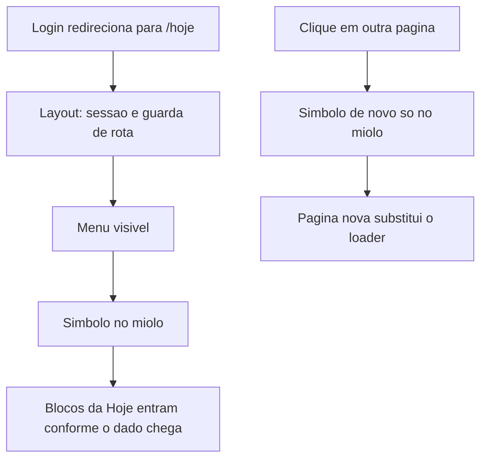

# Plano · Loader da marca e montagem da Hoje

> Sensação de espera nas telas autenticadas · Autonomia: **medium**
> Status: **rascunho · aguardando aprovação**
> Data: **2026-09-29**
> Origem: a Hoje e outras telas ficam em branco até os GET no banco voltarem. A marca entra como espera, e a Hoje monta os blocos em sequência.

**Pronto quando:** depois do login o símbolo dourado aparece no miolo, gira devagar e cresce um pouco enquanto a Hoje busca os dados; os blocos entram um após o outro, com o menu já visível; ao trocar de página o mesmo loader ocupa só o conteúdo até a tela nova estar pronta; quem pede menos movimento no sistema vê o símbolo parado e os blocos sem deslocamento.

Nenhum código até este plano ser aprovado.

---

## Como usar no workflow

1. Aprovar este plano (e as premissas da última seção, se discordar).
2. Branch `feature/loader-montagem` + código, sem spec longa: o comportamento cabe neste arquivo.
3. Verificação no browser (login, Hoje, troca de página, celular). Não fecha fase do `docs/PLANO.md`.

---

## Objetivo

O banco continua o mesmo. Esta fatia muda o que a pessoa vê enquanto espera.

Hoje não existe `loading.tsx`. [`src/app/(app)/hoje/page.tsx`](../../src/app/(app)/hoje/page.tsx) espera consultas, fila, estoque, lembretes e WhatsApp e só então desenha a página inteira. [`src/app/(app)/layout.tsx`](../../src/app/(app)/layout.tsx) espera sessão, dentistas e status do WhatsApp antes de entregar o miolo. Na troca de rota o conteúdo some até o próximo GET terminar.

Dois momentos:

1. **Entrada e troca de página.** O símbolo da Neo Roma fica no centro do conteúdo. O menu (sidebar no desktop, dock no celular) permanece.
2. **Montagem da Hoje.** O símbolo sai quando o primeiro bloco chega. Cada bloco entra com o mesmo movimento. A ordem é a ordem em que o dado volta.

---

## Premissas (fechar com a aprovação)

1. **Asset.** O arquivo apontado (`public/brand/favicon-32.png`) é o símbolo dourado, 32 px, fundo transparente. Na tela usamos [`public/brand/icon-192.png`](../../public/brand/icon-192.png): a mesma marca, também transparente, e não pixeliza ao crescer. O wordmark (`logo-black.webp`) continua só na sidebar.
2. **O loader não cobre o menu.** `loading.tsx` do App Router fica dentro do layout. A sessão continua bloqueante no layout: sem perfil válido não há shell. Dentistas ativos e status do WhatsApp do menu deixam de segurar essa primeira pintura.
3. **A Hoje é a única tela com blocos independentes nesta fatia.** Agenda, fila, prontuário e estoque ganham o loader da troca de página. A montagem bloco a bloco delas fica para depois, se a espera ainda doer.
4. **Rotas fora do shell não entram:** `/login`, `/fila/resposta`, convite de anamnese, definir senha.
5. **Sem cache de dado clínico.** Não usar `unstable_cache` nem guardar consulta, fila ou estoque entre pedidos. `React.cache` só evita buscar duas vezes a mesma coisa no mesmo request (sessão, dentistas, WhatsApp).
6. **Menos movimento.** `prefers-reduced-motion: reduce` desliga giro, crescimento e deslocamento. O símbolo aparece parado.

---

## 1. Loader no miolo

Componente `PageLoader` em `src/components/layout/page-loader.tsx` (`"use client"` só se a animação precisar; preferir CSS puro num Server Component).

Arquivo de rota: `src/app/(app)/loading.tsx`. Vale para toda página autenticada. O Next mostra esse fallback na hora da navegação e troca pelo conteúdo quando o segmento da página está pronto. O layout compartilhado continua interativo.

Movimento, em `src/app/globals.css`:

| Propriedade | Valor |
| --- | --- |
| Tamanho na tela | cerca de 72 px |
| Giro | uma volta em 2,6 s, linear, contínuo |
| Crescimento | de 0,82 para 1 em 1,1 s, ease-out, uma vez |
| Aparição | opacidade 0 por 150 ms, depois entra. Página que responde antes disso não pisca o loader |
| Fundo | o creme da página, sem cartão em volta do símbolo |
| Texto | `alt` "Carregando". Sem frase extra |

O crescimento para em 1. Não fica pulsando.

---

## 2. Layout deixa o miolo livre

Em [`src/app/(app)/layout.tsx`](../../src/app/(app)/layout.tsx) a ordem fica:

1. `headers()` + `requireAuthSession` + `assertRouteAccess`. Isso continua antes do shell. É a guarda.
2. Menu com os módulos do papel (já está em memória, sem banco).
3. `getActiveDentists` e `getClinicWhatsAppSessionStatus` num Server Component filho, dentro de `<Suspense>`. O chip de WhatsApp e a contagem de dentistas aparecem quando voltam. O restante do menu não espera.

Sem esse corte, o `loading.tsx` não aparece na primeira abertura: o layout lê cookie e banco, e o Next segura a navegação até o layout terminar. O doc desta versão está em `node_modules/next/dist/docs/01-app/03-api-reference/03-file-conventions/loading.md`.

`React.cache` em:

- `getAuthSession` (`src/lib/auth/session.ts`)
- `getActiveDentists` (`src/features/agenda/queries.ts`)
- `getClinicWhatsAppSessionStatus` (`src/features/whatsapp/queries.ts`)

A Hoje e o layout pedem os três hoje. No mesmo request passa a ser uma leitura só.

---

## 3. Hoje monta por bloco

[`src/app/(app)/hoje/page.tsx`](../../src/app/(app)/hoje/page.tsx) deixa de fazer `await Promise.all` de tudo antes do `return`. Ela lê a sessão (já em cache), decide o que o papel pode ver e devolve os blocos, cada um num `<Suspense>`.

Cada bloco é um Server Component async ao lado da rota, em `src/app/(app)/hoje/`:

| Bloco | Dado | Quem vê |
| --- | --- | --- |
| Saudação | sessão já resolvida, sem GET extra | todos |
| Números (consultas, fila, ofertas, estoque) | consultas do dia, resumo da fila, alertas | todos |
| WhatsApp | status da sessão | papéis que já veem o card |
| Consultas de hoje | consultas + lembretes daqueles ids | todos |
| Falhas de lembrete | lembretes recentes com falha | admin |
| Fila aguardando | resumo da fila | todos |
| Estoque abaixo do mínimo | alertas | todos |

A saudação pode sair no primeiro HTML, junto com o menu. Não espera os GET.

Fallback de bloco: o lugar reservado, altura próxima do bloco real (números, cartão de consultas, cartão de fila, cartão de estoque), borda e fundo já usados na Hoje. Sem segundo logo. Sem shimmer.

Entrada, quando o HTML do bloco chega:

- opacidade de 0 para 1
- sobe 8 px
- cerca de 280 ms, ease-out
- se vários chegarem no mesmo instante, atraso de 50 ms entre eles (0, 50, 100, 150)

O símbolo do `loading.tsx` cobre a espera até a página devolver esses slots. Como a página não espera os GET, essa troca é rápida e os slots é que seguram o lugar. O movimento de entrada é o "montar em harmonia".

Consultas e lembretes continuam em sequência dentro do bloco de consultas: o lembrete depende dos ids. Não vira um bloco solto.

---

## Fora deste corte

- Índice, SQL mais curto ou cache entre requests.
- Loader em tela cheia por cima do menu.
- Animar `/login` antes do redirect.
- Fatiar agenda, fila, prontuário ou estoque em blocos.
- Barra de progresso no topo.

---

## Verificação

No browser, com o app local:

1. Login como admin. O menu aparece e o símbolo está no miolo. Os blocos da Hoje entram em seguida, sem salto grande de layout.
2. Ir para Fila e voltar para Hoje. O menu não remonta. O símbolo ocupa o conteúdo até a página responder.
3. Papel sem card de WhatsApp (auxiliar não entra na Hoje; usar visualizador ou dentista, conforme a matriz). O bloco some. O loader continua o mesmo.
4. Viewport estreito: símbolo centralizado na área da dock, sem cobrir a barra.
5. `prefers-reduced-motion: reduce`: símbolo parado, blocos sem subida.
6. Recarregar a Hoje direto na URL: mesma espera, sem tela branca longa antes do menu.

---

## Análise

O `loading.tsx` é a peça que o App Router já reserva para essa espera. Fatiar a Hoje em `Suspense` é o que separa "a página inteira pisca junta" de "cada bloco entra quando o GET dele volta". O `cache()` na sessão e nos dois GET do menu tira a leitura duplicada que hoje acontece em todo pedido da Hoje, sem guardar dado clínico entre visitas.

O risco é o layout. Se a guarda de sessão continuar no meio dos outros GET, o símbolo não aparece na primeira abertura e a fatia parece não ter funcionado. Por isso o passo 2 vem junto com o loader, não depois.
