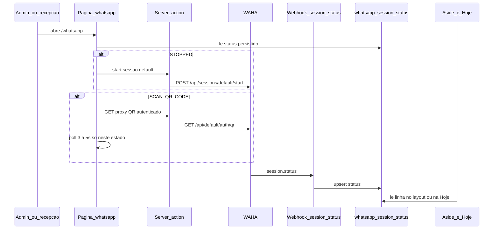

# Plano · Tela de QR da sessão WhatsApp

> Fatia operacional (F7, passo 6 da arquitetura) · Autonomia: **medium**
> Status: **rascunho · aguardando aprovação**
> Data: **2026-08-29**
> Origem: vault `2026-08-29-tela-qr-whatsapp` (decisão) · ajuste: recepção com `write`

**Pronto quando:** admin ou recepção abre `/whatsapp`, inicia a sessão `default` se estiver parada, vê o QR só em `SCAN_QR`, faz logout se precisar; o ponto fica verde em `WORKING`; aside e Hoje leem o banco (não a WAHA); dentista só o card na Hoje; auxiliar/viewer sem item e sem rota.

Nenhum código até este plano ser aprovado.

---

## Como usar no workflow

1. Aprovar este plano (e as premissas da última seção, se discordar).
2. Spec curta no repo + branch + código.
3. Ops da WAHA (webhook HMAC) fica no checklist de homologação, não neste código.

---

## Objetivo

Parear o número da clínica **dentro** do ClinRoma. A equipe não usa o dashboard da WAHA. O Next no servidor chama o gateway; a chave nunca vai ao client.

Matriz (ajuste sobre o research: recepção com `write`, para parear no dia a dia):

- **admin** e **reception:** write (QR, start, logout) + status (aside, chip, card, rota `/whatsapp`)
- **dentist:** só o card na Hoje, sem item, sem rota
- **auxiliar / viewer:** nada

Indicador: ponto verde estável se `WORKING`; vermelho piscando se não. Dock mobile não ganha 6º item (atalho pela Hoje, igual `stock-scan`).

---

## 1. Abordagem (6 passos)

**Passo 1. Spec + matriz RBAC.** Spec curta no repo a partir da decisão do vault, com o flip: `whatsapp` = `write` para **admin e reception**. Prefixo `/whatsapp` em [`src/lib/auth/roles.ts`](../../src/lib/auth/roles.ts), [`src/types/clinroma.ts`](../../src/types/clinroma.ts), [`src/lib/auth/guard.ts`](../../src/lib/auth/guard.ts). `AUTHENTICATED_ROUTE_PREFIXES` inclui `/whatsapp`. Desktop aside mostra o item só para quem tem o módulo. [`getMobileNavModules`](../../src/components/app-shell.tsx) exclui `whatsapp` (como já exclui `stock-scan`). Testes: admin e reception com `write`; dentist/auxiliar/viewer `none`. Teste do admin deixa de esperar 6 módulos.

**Passo 2. Persistência + webhook.** Migration `027_whatsapp_session_status.sql`: uma linha por sessão (`session_name` PK, valor `default`). Colunas: `status` (texto do domínio), `updated_at`. RLS: `SELECT` para admin, dentist, reception; sem `INSERT`/`UPDATE` para `authenticated`; escrita só com `service_role`. Seed da linha `default` com `STOPPED`. Rota **não cron** [`src/app/api/webhooks/waha/route.ts`](../../src/app/api/webhooks/waha/route.ts): aceita só `event === "session.status"`, valida HMAC `X-Webhook-Hmac` (sha512 do body, nativo da WAHA) com `WHATSAPP_WEBHOOK_SECRET`, upsert via [`createAdminClient`](../../src/lib/supabase/admin.ts), `revalidatePath` de `/whatsapp`, `/hoje` e o layout. Sem consultar a WAHA no [`src/app/(app)/layout.tsx`](../../src/app/(app)/layout.tsx).

**Passo 3. Cliente WAHA de sessão (server-only).** Novo lib em `src/features/whatsapp/`, reusando `readWhatsAppChannelConfig` de [`src/lib/whatsapp/send-whatsapp.ts`](../../src/lib/whatsapp/send-whatsapp.ts). **Não mudar** o contrato de `sendWhatsApp`. Endpoints: `POST /api/sessions/{session}/start`, `POST /api/sessions/{session}/logout`, `GET /api/{session}/auth/qr` com `Accept: image/png` e o mesmo `X-Api-Key`. Mapear `SCAN_QR_CODE` da WAHA para `SCAN_QR` no domínio. `PASSKEY_REQUIRED` e `FAILED` entram no balde "não WORKING" (vermelho), sem UI extra.

**Passo 4. Tela `/whatsapp` + proxy do QR.** Página em [`src/app/(app)/whatsapp/page.tsx`](../../src/app/(app)/whatsapp/page.tsx). RSC lê o banco. Se o papel tem `write` (admin ou recepção) e o status é `STOPPED`, action `start` na sessão `default`. Se `SCAN_QR`, o client mostra a imagem do proxy autenticado [`src/app/api/whatsapp/qr/route.ts`](../../src/app/api/whatsapp/qr/route.ts) (sessão + `write`) e faz poll 3–5 s **só nesse estado**. `WORKING`: some o QR, para o poll. Logout com confirmação, mesmo `write`. Actions e proxy recusam dentist, auxiliar e viewer no servidor.

**Passo 5. Aside e Hoje.** Layout RSC lê a linha e passa um prop serializável ao [`AppShell`](../../src/components/app-shell.tsx) (client). Chip no bloco `EnvChips` só para admin e reception: verde estável / vermelho piscando. Card na [`src/app/(app)/hoje/page.tsx`](../../src/app/(app)/hoje/page.tsx) para admin, reception e dentista. Link para `/whatsapp` só se `canAccessModule(..., "whatsapp")` (admin e recepção). Dentista: status sem link (ou copy "peça à recepção ou ao admin"). Não embutir QR na Hoje.

**Passo 6. Testes, segurança, docs.** Vitest de domínio (mapa de status, RBAC, HMAC, start/logout/QR só com `write`). Estender [`roles.test.ts`](../../src/lib/auth/roles.test.ts) (reception `write`; dentist `none`), [`app-shell.test.ts`](../../src/components/app-shell.test.ts) e o caso RLS em [`rls-policy.test.ts`](../../src/lib/auth/rls-policy.test.ts). Atualizar [`.env.example`](../../.env.example), [`docs/SECURITY.md`](../SECURITY.md) e o trio vivo (implementation, manual-dev, PENDENCIAS). Não fecha a Fase 7.

---

## 2. Arquivos a criar / alterar

**Criar**

- `specs/2026-08-29-tela-qr-whatsapp.md`
- `supabase/migrations/027_whatsapp_session_status.sql`
- `src/features/whatsapp/domain/session-status.ts` + `session-status.test.ts`
- `src/features/whatsapp/domain/webhook-hmac.ts` + teste
- `src/features/whatsapp/lib/waha-session.ts` + teste (start, logout, QR; fetch injetável)
- `src/features/whatsapp/lib/persist-session-status.ts`
- `src/features/whatsapp/permissions.ts`
- `src/features/whatsapp/queries.ts`
- `src/features/whatsapp/actions.ts`
- `src/features/whatsapp/components/whatsapp-session-panel.tsx`
- `src/features/whatsapp/components/whatsapp-status-card.tsx`
- `src/app/(app)/whatsapp/page.tsx`
- `src/app/api/whatsapp/qr/route.ts`
- `src/app/api/webhooks/waha/route.ts`
- `docs/implementation/F7-10-tela-qr-whatsapp.md`
- `docs/manual-dev/19-fase-7-10-tela-qr-whatsapp.md`

**Alterar**

- [`src/lib/auth/roles.ts`](../../src/lib/auth/roles.ts), [`roles.test.ts`](../../src/lib/auth/roles.test.ts), [`guard.ts`](../../src/lib/auth/guard.ts)
- [`src/types/clinroma.ts`](../../src/types/clinroma.ts) (`CLINROMA_MODULES`)
- [`src/components/app-shell.tsx`](../../src/components/app-shell.tsx), [`app-shell.test.ts`](../../src/components/app-shell.test.ts)
- [`src/app/(app)/layout.tsx`](../../src/app/(app)/layout.tsx)
- [`src/app/(app)/hoje/page.tsx`](../../src/app/(app)/hoje/page.tsx)
- [`src/lib/supabase/database.types.ts`](../../src/lib/supabase/database.types.ts)
- [`src/lib/auth/rls-policy.test.ts`](../../src/lib/auth/rls-policy.test.ts)
- [`.env.example`](../../.env.example) (`WHATSAPP_WEBHOOK_SECRET`, vazio)
- [`docs/SECURITY.md`](../SECURITY.md)
- [`docs/implementation/README.md`](../implementation/README.md), [`docs/manual-dev/README.md`](../manual-dev/README.md), [`docs/state/PENDENCIAS.md`](../state/PENDENCIAS.md)

**Não alterar o contrato:** [`src/lib/whatsapp/send-whatsapp.ts`](../../src/lib/whatsapp/send-whatsapp.ts) (`destino` + `texto`). Só reutilizar `readWhatsAppChannelConfig`.

---

## 3. Fora de escopo

- Inbox, bot, conversa, DeskcommCRM
- Multi-número / segunda sessão
- Dashboard WAHA para staff; iframe de `waha-neoroma.modernxlab.com.br`
- Reusar `/estoque/scan`, `/hoje` como tela do QR, ou criar `/configuracoes`
- Rota cron nova, `vercel.json`, crontab, SSH, instalar/reconfigurar Docker da WAHA no código
- Write para dentista, auxiliar ou viewer
- Pareamento WebAuthn (`PASSKEY_REQUIRED`)
- Número pessoal do Felipe (homologação: número de teste, ~7 dias)
- Fechar a Fase 7 inteira

Ops manual (não é código deste plano, mas a fatia não homologa sem isso): na sessão `default` da WAHA, webhook `session.status` → `https://neo-roma.vercel.app/api/webhooks/waha` com HMAC = `WHATSAPP_WEBHOOK_SECRET` da Vercel.

---

## 4. Riscos técnicos

- **Aside stale.** O layout não consulta a WAHA e não faz poll. O chip só muda depois do webhook + revalidate, ou na próxima navegação. Aceito pelo research; o poll fica só na tela em `SCAN_QR`.
- **Webhook falha ou HMAC errado.** Status no app fica velho; disparos (`sendWhatsApp`) quebram em silêncio. Mitigar: secret próprio (não `CRON_SECRET`), log sem PHI, homologar o evento `WORKING` com número de teste.
- **QR que gira.** A WAHA troca o QR; poll 3–5 s com `Cache-Control: no-store` no proxy. Sem cache de CDN na imagem.
- **Logout derruba o canal.** Todos os disparos (pós-cirurgia, anamnese, oferta da fila) param. Botão só quem tem `write` (admin e recepção), com confirmação. Recepção opera o pareamento no expediente; o risco de desligar o chip no meio do dia sobe. Copy do diálogo deixa isso explícito.
- **Layout e RBAC.** [`roles.ts`](../../src/lib/auth/roles.ts) e [`app-shell.tsx`](../../src/components/app-shell.tsx) são path de toda página autenticada. Regressão: dock com 6 itens, auxiliar vendo `/whatsapp`, dentista caindo em 403 pelo card. Reception precisa de `write` nas actions e no proxy do QR, não só no aside. Testes de matriz e `getMobileNavModules` são obrigatórios.
- **Tunnel / Cloudflare Access.** O Next na Vercel já precisa alcançar a WAHA para `start`/`qr`/`sendText`. Se o Access bloquear a Vercel, a tela quebra igual o disparo de hoje. Fora do código; não "consertar" com iframe.
- **Linha única.** Sem a row `default`, aside e Hoje não têm o que ler. Seed na migration.

---

## 5. Path crítico

**Sim.**

Toca:

- Matriz e guarda de rotas: [`src/lib/auth/roles.ts`](../../src/lib/auth/roles.ts), [`guard.ts`](../../src/lib/auth/guard.ts)
- Shell de todas as páginas autenticadas: [`src/components/app-shell.tsx`](../../src/components/app-shell.tsx), [`src/app/(app)/layout.tsx`](../../src/app/(app)/layout.tsx)
- Home: [`src/app/(app)/hoje/page.tsx`](../../src/app/(app)/hoje/page.tsx)
- Nova superfície pública autenticada por secret: `/api/webhooks/waha` (HMAC; `service_role` no server)
- Canal WhatsApp operacional (logout/QR afetam pós-cirurgia, convite e oferta da fila), **sem** editar o body de `sendWhatsApp`

Não toca: conflito de agenda, tokens da fila, anamnese pública, scan de insumo, jobs `/api/cron/*`.

---

## Premissas (apontar se discordar)

1. Reception tem o mesmo `write` que admin: QR, start e logout (ajuste pedido sobre o research).
2. Card do dentista na Hoje não linka para `/whatsapp`.
3. Auto-`start` ao abrir a tela, se o papel tem `write` e o status é `STOPPED`.
4. HMAC sha512 (`X-Webhook-Hmac`), env `WHATSAPP_WEBHOOK_SECRET`.
5. Feature nova em `src/features/whatsapp/`, não misturar com estoque nem com `records`.
